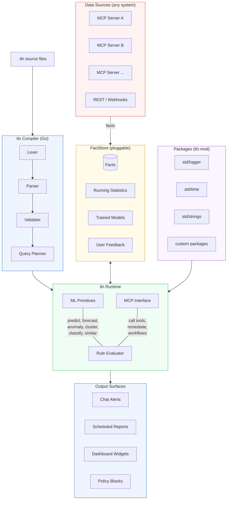
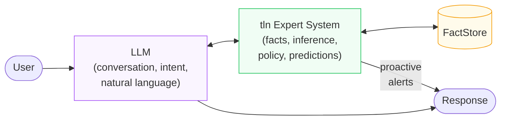

# tln

**A domain-agnostic expert system language with built-in ML primitives.**

[](https://github.com/opentalon/tln-language/actions/workflows/ci.yml)
[](LICENSE)
[](https://go.dev)

---

tln introduces a new concept: **Expert-in-the-Loop**. Instead of a human reviewing every AI decision, a deterministic expert system sits alongside the LLM — reasoning over facts, enforcing policies, and predicting outcomes. The LLM handles conversation and intent. tln handles knowledge and inference. They work together.

## What is tln?

tln is a rule language for building expert systems. It reasons over structured facts from any data source — inventory, CRM, ERP, IoT sensors, ticketing systems, or anything that produces structured data. Rules detect patterns, enforce policies, predict outcomes, and automate workflows.

tln is:
- **Domain-agnostic** — works for fleet management, construction, supply chain, HR compliance, hospitality, sales optimization, or any domain with structured data.
- **Readable** — rules look like English. A domain expert can read, write, and audit them without programming experience.
- **Adaptive** — thresholds learn from each tenant's own data. Rules get smarter over time.
- **Deterministic** — detections are explainable and auditable. No black-box predictions.
- **Testable** — rules have their own test framework (`.tln.test` files).

## Example

A construction site is burning through cement faster than expected. tln detects it, forecasts when stock hits zero, and tells procurement exactly how much to order:

```tln
detect "Cement running low" {
  for records where type == "stock_item"
    and attr "name" == "Portland Cement 50kg"
    and attr "current_stock" <= attr "minimum_amount"
    and status == "active"
  flag matching items
  label "{item.name}: {attr.current_stock} bags left (minimum: {attr.minimum_amount})"
  priority CRITICAL
}

forecast "Cement stock-out date" {
  for records where type == "stock_item"
    and attr "name" == "Portland Cement 50kg"
  series attr "current_stock" over last 30 days
  predict days_until value <= 0
  when days_until < 7
  label "{item.name}: stock hits zero in ~{days_until} days at current usage"
  priority CRITICAL
}

recommend "Order cement" {
  when detect "Cement running low" matches
  calculate avg_weekly from activities
    where type == "consume" within last 30 days
  suggest "Order {avg_weekly * 4 - attr.current_stock} bags of {item.name}
           to cover 4 weeks at current consumption (~{avg_weekly}/week)"
}
```

No LLM involved. No API calls to figure out what's running low. tln watches the data and tells you before the site stops.

## Installation

### Prebuilt binaries (recommended)

Each tagged release publishes a `tln` binary for linux/amd64, linux/arm64, darwin/amd64, darwin/arm64, and windows/amd64. Grab one from the [Releases page](https://github.com/opentalon/tln-language/releases) or use the snippet for your platform:

```bash
# macOS (Apple Silicon) — adjust the URL for linux/x86_64 etc.
TAG=$(curl -sL https://api.github.com/repos/opentalon/tln-language/releases/latest | grep '"tag_name"' | cut -d '"' -f 4)
curl -fsSL "https://github.com/opentalon/tln-language/releases/download/${TAG}/tln-${TAG}-darwin-arm64.tar.gz" \
  | tar -xz
./tln version
```

Every release ships with a `SHA256SUMS.txt` file in case you want to verify the download.

### From source

If you already have Go 1.25+ installed:

```bash
go install github.com/opentalon/tln-language/cmd/tln@latest
tln version
```

### Try the REPL

The fastest way to see tln in action — load a real example, evaluate every
block, and trace one to see the per-step query plan:

```bash
tln repl
tln> :load examples/insurance_claims.tln
  loaded examples/insurance_claims.tln: 5 block(s), 0 fact(s)
tln> :load test/insurance_claims.tln.test
  loaded test/insurance_claims.tln.test: 0 block(s), 28 fact(s)
tln> :eval all
  "Auto-approve in-network routine": 1 detection(s) — records [902]
  "Out-of-network provider":         1 detection(s) — records [904]
  "Over the per-visit cap":          2 detection(s) — records [903 904]
  "Reject blacklisted provider":     1 detection(s) — records [901]
tln> :trace "Over the per-visit cap"
  "Over the per-visit cap": 2 detection(s) — records [903 904]
    trace:
    step 1  DatalevinQuery → candidates  (rows: [903 904])
    step 2  GoComputation render_template → detections
```

The full walkthrough — including how to read trace output, the
LLM-extracts-facts-then-Tln-decides pattern from
[Code Mode for MCP](https://opakalex.github.io/posts/code-mode-for-mcp/),
and what each REPL command does — is in [`docs/repl.md`](docs/repl.md).

## FactStore backends

`tln run` picks its built-in fact backend with `--store`:

| Backend | When to use | Setup |
|---|---|---|
| `datalevin` (default) | Production today. JVM sidecar, native Datalog, FTS, raft. | `cd datalevin-server && clojure -M:run` |
| `memory` | REPL, demos, unit tests, CI smoke runs. Entirely in-process. | None — works out of the box |

Backends are **pluggable**: any type implementing the public
[`pkg/factstore.FactStore`](./pkg/factstore/factstore.go) SPI can be wired in via
the Go SDK's `tln.WithFactStore(...)` — tln core has zero Go dependency on any
database.

### tln-db — Go-native backend (plugin)

[**opentalon/tln-db**](https://github.com/opentalon/tln-db) is the Go-native
backend: an embedded bbolt store with roaring-bitmap + HNSW vector indexes,
served over gRPC (`tlndb-server`). It used to live in core as the
`--store talon-db` adapter; it was **cut from core** and now lives in its own
repo, where `tlnstore` implements `pkg/factstore.FactStore` directly — so the
language stays storage-agnostic and code-free at the boundary.

```bash
# 1. run the server (embedded bbolt, gRPC over a Unix socket)
tlndb-server --db ./tln.bbolt --socket /tmp/tlndb.sock
```

```go
// 2. wire it into tln.Run via the SPI — no adapter shim
import (
    "github.com/opentalon/tln-language/pkg/tln"
    "github.com/opentalon/tln-db/tlnstore"
)

cli, _ := tlnstore.NewClient(ctx, "unix:///tmp/tlndb.sock")
tln.Run(ctx, program, tln.WithFactStore(tlnstore.New(cli)))
```

It also serves the HNSW index behind `find similar` (see
[Vector similarity](#vector-similarity-hnsw)).

## Plugins & bundling (`mod.tln`)

tln core is plugin-free — every external capability is a plugin behind an SPI
(`ToolResolver` for tools, `FactStore` for stores). You add them the way Ruby's
Bundler adds gems: declare them in **`mod.tln`**, run **`tln bundle`**, and
`tln run` uses them — **no Go**.

```tln
# mod.tln  — one line per plugin (source defaults to github.com/opentalon/tln-<name>)
plugin "mcp"    "v0.1.0"
plugin "io"     "v0.1.0"
plugin "prolog" "v0.1.0"
plugin "asp"    "v0.1.0"
```

```tln
# rules.tln  — name a plugin with `connector`, call it with `tool`
connector "inventory" via mcp    { endpoint env "INV_URL" bearer env "INV_TOKEN" }
connector "reason"    via prolog { }

workflow "demo" {
  step "list"  { tool "inventory" "list-items" { query "x" } }
  step "kin"   { tool "reason" "query" { program "parent(tom,bob). ancestor(X,Y):-parent(X,Y)." goal "ancestor(tom, D)" } }
}
```

```bash
tln init demo && cd demo   # scaffold mod.tln + rules.tln
tln bundle                 # like `bundle install`: compile the declared plugins in
tln run rules.tln          # connectors resolve; no main.go, ever
```

Go can't load Go code at runtime without a dependency cycle (core must never
import a plugin), so `tln bundle` **generates a bootstrap and compiles** a
project-local `tln` with the plugins baked in (registering each plugin's
`Factory` via `WithPlugin`). Credentials come from the environment via `env`,
never inlined — and `env` is valid only inside a `connector`, so secrets can't
leak into labels, facts, or tool args. Design: [ADR 0013](docs/design/0013-mod-tln-plugin-loading.md).

The four base plugins ([tln-mcp](https://github.com/opentalon/tln-mcp),
[tln-io](https://github.com/opentalon/tln-io),
[tln-prolog](https://github.com/opentalon/tln-prolog),
[tln-asp](https://github.com/opentalon/tln-asp)) each expose a `Factory`; any
GitHub module with one is a plugin (use `from "…"` for a non-conventional path).

### The backing store — Active Record style

The store is chosen by config, defaulting to **in-memory**. Add a `store` plugin
to `mod.tln` and a `config/store.tln`, and that becomes the store — same program,
no code change:

```tln
# mod.tln
plugin "db" "v0.1.0" store
```
```tln
# config/store.tln  (absent → in-memory)
store db { target env "TLNDB_ADDR" }
```

Precedence: host `WithFactStore` > the `mod.tln` store plugin + `config/store.tln`
> in-memory. One store per project. ([tln-db](https://github.com/opentalon/tln-db)
is a sidecar — the bundle carries the client; `tlndb-server` runs separately.)

## Architecture



### How data flows

1. **Facts come in** — MCP tool results, API responses, webhooks, or any structured data source feed facts into the FactStore.
2. **Rules compile** — `.tln` files are compiled by the tln compiler (Lexer, Parser, Validator, Query Planner).
3. **Rules evaluate** — the runtime queries the FactStore, runs ML primitives, and produces detections, predictions, and recommendations.
4. **Results go out** — detections surface as chat alerts, scheduled reports, dashboard widgets, or policy blocks.

## Block Types

| Block | Purpose | Question it answers |
|-------|---------|-------------------|
| `detect` | Find patterns in data | "What's wrong? What's unusual?" |
| `rule` | Enforce constraints | "Is this action allowed?" |
| `recommend` | Suggest actions | "What should I do about it?" |
| `combine` | Find optimal combinations | "What's the best mix?" |
| `define` | Reusable conditions | (helper, used by other blocks) |
| `derive` | Derived facts (Datalog rules) | "What follows from what I know?" |
| `workflow` | Multi-step MCP orchestration | "Do these steps in order." |
| `model` | A trained ML model with inline fitted params | "Classify/predict from a pinned model." |
| `module` | Namespace + export reusable blocks | "Package this and import it elsewhere." |

Plus `forecast`, `cluster`, `classify`, `decide` ([typed decisions](#typed-decisions--laya--jev)), `predict`, `find similar`, `find related`, `on` (reactive), `constraint`, `enrich`, `collect`, and cached `threshold`.

## ML Primitives

tln has built-in ML keywords. Not heavyweight neural nets — lightweight statistical primitives that run in milliseconds on structured data.

| Keyword | What it does | Under the hood |
|---------|-------------|----------------|
| `learned_threshold` | Adaptive parameter from tenant's own data | Aggregation (avg, percentile) |
| `is anomaly` | Flag statistical outliers | Z-score, IQR, or MAD |
| `cluster by` | Group similar records | DBSCAN |
| `predict` | Likelihood of an outcome | Decision tree (interpretable) |
| `classify` | Categorize records | kNN over feature vectors |
| `decide` | Typed decision + calibrated distribution over `choices` | kNN distribution, or an external System-1 model |
| `forecast` | When will a value hit a threshold? | Exponential smoothing |
| `find similar` | Records resembling a given one | Cosine similarity, or HNSW vector index via the tln-db plugin |

Every prediction is explainable. A decision tree says "this item is at risk because operating_hours > 2000 AND repair_count > 3." The user can read the reasoning.

### Typed decisions — laya / Jev

A `decide` block takes a fixed set of `choices` and returns a **calibrated
probability distribution** over them — the argmax `chosen` and a `confidence`
you can gate on. It's tln's surface for the "System 1 decision model" pattern,
in two modes.

**Model mode** hands raw text to an external decision model. tln supports
plugging in any System-1 model behind the `using model` handle:
[**laya**](https://huggingface.co/convaiinnovations/laya-typed-decisions)
(open-weights ModernBERT typed decisions),
[**Jev**](https://typesafe.ai/) (hosted), or
[any small LLM's logits](https://www.nobodywho.ai/posts/jev-in-25-lines/). Wrap
it as a tool server, bind it with a `connector`, and tln orchestrates + gates
the decision — it never embeds the model, key, or transport.

```tln
connector "jev-small" via mcp {
  endpoint env "JEV_URL"
  model "Qwen3-0.6B"
}

decide "email_kind" {
  for records where folder == "Inbox"
  choices ["Legitimate", "Spam", "Phishing"]
  ask concat("Subject: ", attr "subject", "\n\n", attr "body")
  using model "jev-small"
  confidence >= 0.9              // act only when the model is sure
}
```

**Deterministic mode** needs no model at all — it reuses tln's own kNN and
exposes the full per-choice distribution (`votes/k`), fully auditable and
reproducible:

```tln
decide "email_kind" {
  for records where folder == "Inbox"
  choices ["Legitimate", "Spam", "Phishing"]
  features [attr "link_count", attr "caps_ratio", attr "sender_age_days"]
  trained_on records where labeled == true
  label_attr "kind"
  confidence >= 0.7
}
// → chosen "Spam", { Legitimate: 0.0, Spam: 0.8, Phishing: 0.2 }
```

The decision (`chosen` / `confidence` / `probabilities`) flows into `when`
guards, labels, and downstream tool args. Full docs: [`docs/decide.md`](docs/decide.md).

### ML modules — train once, reference many

`predict` fits a decision tree inline (`trained_on records where …`); `classify` reads its labeled examples directly (kNN — the examples *are* the model, no training run). Both can also draw from a **pre-fitted `model`** — the model analog of a cached `threshold` — whose fitted params are pinned inline (version-pinned in source with `computed_from` / `valid_until`), so there is no per-run training. (`decide`'s deterministic mode reads labeled examples via `trained_on` like `classify`; its `using model` names a *runtime* decision model, not a pre-fitted `model` block.) Package models under a `module` namespace and import them by name across files:

```tln
// fleet_ml.tln
module "fleet.ml" {
  export model "failure_risk" {
    classify knn k 3
    features [attr "km", attr "age"]
    fitted {
      example [50000, 8] label "high"
      example [10000, 2] label "low"
    }
    computed_from "1204 labeled vehicles"  valid_until "2026-12-31"
  }
}

// app.tln
import "fleet.ml"                        // by module name, not file path
classify "Vehicle failure risk" {
  for records where type == "vehicle" and status == "open"
  using model "fleet.ml.failure_risk"
  confidence >= 0.9
}
```

kNN models store their labeled examples (lazy); decision-tree models store the fitted tree itself (`fitted tree { node … }`, eager). Models resolve from **two providers under the same qualified name** — tln `model` blocks *and* models a host registers in Go — so an embedding host can serve production models tln source references transparently.

## Control flow and string functions

tln stays declarative where it counts, but action bodies (today: `remediate`) support imperative control flow — `if/else`, `for each`, and a bounded `while` — branching on the same condition grammar the rest of the language uses:

```tln
remediate {
  if attr "priority" == "CRITICAL" {
    tool "ops" "page_oncall" { vehicle attr "id" }
  } else {
    tool "ops" "open_ticket" { vehicle attr "id" }
  }
  for each channel in ["fleet-ops", "maintenance"] {
    tool "slack" "notify" { channel channel text "Vehicle {item.id} overdue" }
  }
}
```

Expressions have a string toolkit usable anywhere a value is — `upper`, `lower`, `trim`, `length`, `substring`, `replace`, `concat`, `split`, `join`:

```tln
for records where upper(substring(attr "vin", 0, 3)) == "1FT"
```

…and a date toolkit — `now()`, `date(s)`, `days_until(d)`, `days_between(a, b)` — that complements the `today` keyword and `date ± N units` arithmetic already in the evaluator. `days_until`/`days_between` return a number, so they drive ordinary numeric guards; `now`/`date`/`today` are date values that stringify ISO, so they drop cleanly into a query window:

```tln
for records where days_until(attr "due_on") <= 7        // due within a week
  and attr "due_on" >= today                            // and not already overdue

// build a relative date window for a list-tool query argument:
query concat("due_on:[", today, " TO ", today + 7 days, "]")
```

The string toolkit is mirrored in the JavaScript reactive runtime (`packages/runtime`) — the client-side engine for reactive rules stays in step with the Go compiler.

## Metaprogramming — compile-time macros

> Status: the compile-time expansion **phase is merged** (`internal/macro`, [ADR 0011](docs/design/0011-compile-time-macros.md)) — today an identity transform. The `defmacro`/`quote`/`unquote` **grammar below is accepted design, not yet implemented**, so you can't write a macro just yet — but the ordinary blocks a macro expands into (shown below) are valid tln *today* (verified with `tln build`).

tln does metaprogramming the **Elixir way**: macros are code that writes code, and they run at **compile time**. A `defmacro` expands into ordinary blocks *before* validation and planning — the runtime never sees a macro, so the engine stays exactly as deterministic and terminating as always. The one place unbounded computation is allowed is expansion itself, which is bounded by a step budget (a compile error, never a runtime hang).

This is why metaprogramming lives **in core, not a plugin**: only core owns the grammar and the compile phases. (Runtime "code-as-data" over Prolog terms is a different thing — that belongs to the [tln-prolog](https://github.com/opentalon/tln-prolog) engine, which brings its own term structure.)

`quote` turns a block into an AST value; `unquote` splices a value in; `defmacro` is a compile-time function from arguments to AST. A macro that kills boilerplate across near-identical `detect` rules:

```tln
defmacro over_threshold(name, metric, limit, prio) {
  quote {
    detect "High {unquote(name)}" {
      for records where type == "item" and attr unquote(metric) > unquote(limit)
      flag matching items
      label "{item.name}: high {unquote(name)}"
      priority unquote(prio)
    }
  }
}

over_threshold("temperature", "temp_c", 80, HIGH)
over_threshold("pressure",    "psi",   200, MEDIUM)
```

expands at compile time into two ordinary `detect` blocks — all the validator, planner, and runtime ever see:

```tln
detect "High temperature" {
  for records where type == "item" and attr "temp_c" > 80
  flag matching items
  label "{item.name}: high temperature"
  priority HIGH
}
detect "High pressure" {
  for records where type == "item" and attr "psi" > 200
  flag matching items
  label "{item.name}: high pressure"
  priority MEDIUM
}
```

Because a macro emits nothing but ordinary AST, everything downstream — explainability, testing, the reactive runtime — treats generated rules identically to hand-written ones. That includes `tool` calls: a macro can splice `tool "audit" "writeln" { … }` into every rule it generates, so effect boilerplate is generated too (see [ADR 0012](docs/design/0012-tool-verb-and-connectors.md)).

## Expert-in-the-Loop

Traditional AI systems use **human-in-the-loop** — a human reviews every AI decision. This doesn't scale. tln introduces **expert-in-the-loop** — a deterministic expert system that collaborates with the LLM in real time.



How they collaborate:

| Situation | LLM does | tln does |
|-----------|----------|------------|
| User asks about an item | Understands intent, picks the right tool | Enriches response: "Note: this item is 5,000 km overdue for service" |
| User wants to delete something | Prepares the tool call | Policy check: blocks if user lacks permission |
| Nothing was asked | Nothing (reactive only) | Detects a pattern in the background, surfaces it proactively |
| tln detects a failure risk | Drafts the alert message in the user's language | Ran the prediction, computed the confidence |
| User asks "why?" | Explains in natural language | Provides the trace: which facts, which rule, which threshold |

The LLM is good at language. tln is good at logic. Neither replaces the other.

### Inside OpenTalon

When tln runs as a plugin inside [OpenTalon](https://github.com/opentalon/opentalon), the expert-in-the-loop pattern integrates at three points:

```
User message arrives
  |
  v
[1. tln as preparer]
  |  Evaluates rules against matched tools.
  |  Known patterns → execute directly (skip LLM).
  |  Unknown → pass through to LLM.
  |
  v
[2. LLM agent loop]
  |  Every tool result → asserted into tln's FactStore.
  |  Before each tool call → tln policy check (block/allow).
  |
  v
[3. tln post-execution]
     Evaluates detect/predict/forecast over accumulated facts.
     Appends proactive insights to the response.
```

## More Examples

### Policy enforcement

```tln
rule "Regional data restriction" {
  when tool_action starts_with "inventory"
    and tool_arg "org_unit_id" not in context.allowed_org_units
  block reason "You don't have access to this organisational unit"
}

rule "Certification required for heavy equipment" {
  for records where category in category_tree("Heavy Machinery")
  before "assign"
    when target_person attr "safety_cert_expires" < today
  block "assign"
  reason "{person.name}'s safety certification expired"
}
```

### Temporal patterns

Ordered sequences across records (`A followed_by B [on same KEY] within N units`)
flag entities whose history matches a chain, not just a point-in-time
shape:

```tln
detect "Engine failure chain" {
  for records where type == "vehicle"
    and record type "electrical_fault"
        followed_by record type "engine_failure"
        on same item within 30 days
  flag matching items
  label "{item.name}: electrical fault preceded engine failure"
  priority HIGH
}
```

`event_sequence "A" -> "B" -> "C" within N days` is the same idea for
streams of `:event/...` facts (e.g. cart-abandonment funnels). Both
compile to in-process matchers — no extra service required.

### Anomaly detection

```tln
detect "Unusual consumption" {
  for records where type == "stock_item"
    and attr "weekly_consumption" is anomaly
    compared_to last 12 weeks
  flag matching items
  label "{item.name}: {attr.weekly_consumption} this week (normally ~{avg})"
  priority HIGH
}
```

### Vector similarity (HNSW)

`find similar` can route through a per-scope HNSW index when the rule names
a vector scope. Each tenant can hold multiple embedding models side-by-side —
dimension is locked on first insert into a scope so a 384-dim model never
collides with a 1536-dim one:

```tln
find similar "Find related vehicles" {
  for records where type == "vehicle"
  to 1
  using vector scope "embed3"
  top 5
  within 0.3
}
```

The executor reads the seed's `:vector/<scope>` fact, asks the store for
`top+1` neighbours, drops the seed, applies `within` as a metric-distance
threshold, and narrows the candidate set to the surviving ids. The HNSW index
itself is served by the tln-db backend, which is packaged as a plugin (see
[opentalon/tln-db](https://github.com/opentalon/tln-db#vector-index)); with the
`memory`/`datalevin` stores, `find similar` needs a store that provides the
vector scope.

### Failure prediction

```tln
predict "Equipment failure risk" {
  for records where type == "item" and status == "active"
  features [
    attr "operating_hours",
    attr "age_days",
    attr "repair_count_last_year",
    attr "category"
  ]
  trained_on records where status changed_to "defective"
  confidence >= 0.7
  label "{item.name}: {confidence}% failure risk in next 30 days"
  priority HIGH
}
```

### Workflow with MCP calls

```tln
workflow "Onboard new team member" {
  step "create_person" {
    tool "hr" "create-person" {
      first_name context.first_name
      last_name context.last_name
      org_unit_id context.org_unit
    }
  }

  step "assign_equipment" depends_on "create_person" {
    tool "inventory" "assign-item" {
      item_id context.laptop_id
      person_id step("create_person").result.id
    }
  }

  step "notify" depends_on ["create_person", "assign_equipment"] {
    tool "notifications" "send" {
      channel context.manager_channel
      message "{context.first_name} onboarded. Equipment assigned."
    }
  }
}
```

### Testing

```tln
// maintenance.tln.test

test "Overdue service is detected" {
  given {
    record 501 type "item" category "Vehicles" status "active"
    attr 501 "km" 45000
    attr 501 "last_service_km" 20000
    attr 501 "name" "Truck A"
  }

  when detect "Service overdue"

  expect {
    flagged 501
    label contains "Truck A"
    priority == HIGH
  }
}

test "Up-to-date service is not flagged" {
  given {
    record 502 type "item" category "Vehicles" status "active"
    attr 502 "km" 25000
    attr 502 "last_service_km" 20000
  }

  when detect "Service overdue"

  expect {
    not flagged 502
  }
}
```

## Tooling

| Tool | What it does |
|------|-------------|
| `tln build` | Compile `.tln` files, report errors |
| `tln test` | Run `.tln.test` files (supports `-run NAME`, `-v`, `--junit FILE`, dir walk) |
| `tln repl` | Interactive REPL — assert facts, evaluate rules, trace execution |
| `tln trace` | Step-by-step evaluation trace for debugging |
| `tln mod` | Package manager (`init`, `add`, `tidy`, `verify`) |

## Editor support

Syntax highlighting + file detection for `.tln` and `.tln.test` files:

| Editor | Plugin | Install |
| --- | --- | --- |
| Vim / Neovim | **[opentalon/tln-vim](https://github.com/opentalon/tln-vim)** | `Plugin 'opentalon/tln-vim'` (Vundle), `Plug 'opentalon/tln-vim'` (vim-plug), or git-clone into `pack/*/start/` (Neovim native) |
| VS Code | **[opentalon/tln-vscode](https://github.com/opentalon/tln-vscode)** | `git clone https://github.com/opentalon/tln-vscode ~/.vscode/extensions/opentalon.tln-vscode-0.1.0` then reload |

Both plugins mirror the keyword list in
[`internal/lexer/lexer.go`](./internal/lexer/lexer.go), so block
headers, ML primitives, template interpolations (`{item.name}`),
priorities, and comments all colour correctly out of the box.

A future LSP server (autocomplete, on-save diagnostics, go-to-definition)
will work across both editors; tracked in
[issue #18](https://github.com/opentalon/tln-language/issues/18).

## Roadmap

### Language and Vision

- [Spec v0.1](https://github.com/opentalon/tln-language/issues/1) — language specification
- [MCP tool calling integration](https://github.com/opentalon/tln-language/issues/2) — tln as deterministic fast-path for MCP
- [Learning from data](https://github.com/opentalon/tln-language/issues/3) — adaptive thresholds, pattern discovery, feedback loop
- [MCP interface](https://github.com/opentalon/tln-language/issues/17) — tln calls MCP tools natively

### Architecture

- [FactStore: first backend](https://github.com/opentalon/tln-language/issues/4) — pluggable fact storage
- [Self-contained language](https://github.com/opentalon/tln-language/issues/5) — tln compiles directly to query plans, no intermediate layer
- [ML primitives as keywords](https://github.com/opentalon/tln-language/issues/6) — predict, forecast, anomaly, cluster, classify, similar
- [FactStore abstraction](https://github.com/opentalon/tln-language/issues/14) — database independence
- [opentalon/tln-db](https://github.com/opentalon/tln-db) — Go-native backend (bbolt + roaring + vellum, gRPC sidecar); consumed as a plugin, not a core dependency

### Compiler

- [Compiler roadmap](https://github.com/opentalon/tln-language/issues/7) — umbrella issue
  - [Lexer + Parser](https://github.com/opentalon/tln-language/issues/8)
  - [Validator](https://github.com/opentalon/tln-language/issues/9)
  - [Query Planner + Emitter](https://github.com/opentalon/tln-language/issues/10)
  - [ML Primitives Runtime](https://github.com/opentalon/tln-language/issues/11)
  - [Metaprogramming](https://github.com/opentalon/tln-language/issues/12) — Go generates `.tln` rules from data
  - [Self-hosting](https://github.com/opentalon/tln-language/issues/13) — tln compiler in tln (v2+). Groundwork landed: imperative control flow, string builtins, and an importable ML-module system. Remaining language gaps: first-class maps/trees, functions with return values, and a pure `source → code` entry point (file I/O stays a host responsibility, by design).

### Ecosystem

- [Testing framework](https://github.com/opentalon/tln-language/issues/16) — `.tln.test` files
- [Editor support](https://github.com/opentalon/tln-language/issues/18) — Vim, Neovim, VS Code, LSP
- [Plugin system and package manager](https://github.com/opentalon/tln-language/issues/19) — `tln.mod`
- [Observability](https://github.com/opentalon/tln-language/issues/20) — logging, tracing, metrics, audit
- [REPL and playground](https://github.com/opentalon/tln-language/issues/21) — interactive exploration

## References

- [OpenTalon](https://github.com/opentalon/opentalon) — the orchestration platform tln integrates with
- [tln Language Spec v0.1](https://github.com/opentalon/tln-language/issues/1) — full syntax reference

## License

Apache 2.0 — see [LICENSE](LICENSE).
